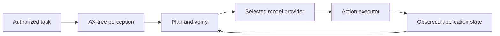

# AX Relay

> Accessibility-aware macOS automation with explicit verification, safety boundaries, and provider independence.

AX Relay is a macOS computer-use runtime designed around a simple reliability rule: a model may choose a **numbered interface element**, but it never invents a screen coordinate.

It is a technical case study in making AI-assisted automation more observable and easier to validate—not a claim that desktop automation is universally reliable.

## Why the Accessibility tree matters

Most computer-use systems ask a model to estimate pixel coordinates from a screenshot. AX Relay instead reads the macOS Accessibility (AX) tree, enumerates interactive elements, and lets the model select an element ID. The executor resolves that ID using operating-system data.



This changes the question from “where should the model click?” to “which known interface element should it act on?”

## What is implemented

- **AX-tree perception** of visible, accessible macOS controls.
- **Provider separation and controlled failover** in the model client.
- **Perceive → plan → act → verify** execution with task-start baselines.
- **Send-versus-type protection** so visible pre-existing text is not mistaken for a completed send.
- **Destructive-action gate** for configured action types.
- **Optional Telegram bridge** restricted to one configured authorized chat ID.
- **Persistent corrective lessons** and an external watchdog for bounded recovery behavior.

## Repository guide

| Area | Purpose |
|---|---|
| [Architecture](docs/architecture.md) | As-built components, design decisions, data boundary, and limitations. |
| [Verification](docs/verification.md) | Portable test scope, CI boundaries, and manual release checks. |
| [Safety](docs/safety.md) | Permissions, credentials, remote-control boundaries, and reporting guidance. |
| [Development and authorship](docs/ai-collaboration.md) | Clear disclosure of my role and AI assistance. |
| [Security policy](SECURITY.md) | Rules for secrets, tokens, and vulnerability reporting. |

## Run locally

AX Relay requires macOS, Python 3.11, and user-granted Accessibility permissions.

```bash
cp .env.example .env
# Add provider and Telegram values only to the local .env file.

python3.11 -m venv .venv
.venv/bin/pip install -r requirements.txt

bash scripts/check-public-safety.sh
scripts/run-agent.sh "<task>"
```

Never commit `.env`, screenshots, chat IDs, local paths, or provider credentials.

## Verification

The portable test suite covers provider failover, lessons persistence, app-name and stale-state verification, and destructive-action gating.

```bash
bash scripts/check-public-safety.sh
cd agents
../.venv/bin/python test_rate_limit_verifier.py
../.venv/bin/python test_lessons.py
../.venv/bin/python test_appname_verify.py
../.venv/bin/python test_executor_gate.py
```

These four Python suites and the public-safety scan passed locally on 2026-07-09 with Python 3.11. The GitHub Actions workflow runs the portable checks on Linux; tests that depend on live macOS Accessibility behavior remain explicitly macOS-only.

## Privacy and safety boundary

AX Relay is local-first, but selected model providers receive task text and Accessibility-tree observations. Optional screenshots and remote notifications can create additional sharing paths. Use least-privilege accounts, avoid sensitive applications, and review the policies of every configured provider and channel.

The project includes useful safeguards; it is not a substitute for a hardened security boundary. See [Safety](docs/safety.md) for the full model.

## My role and AI assistance

I defined the project’s scope, architecture, constraints, test scenarios, and acceptance criteria; coordinated the implementation; and validated behavior against the documented checks. The central design choice—selecting numbered AX elements rather than generating coordinates—was part of that architectural work.

Claude/Opus assisted with architecture and reasoning. GLM-5.2, used through Claude Code, assisted with implementation and iteration. This repository does not present AI-assisted implementation as solely hand-written code. Details are in [Development and authorship](docs/ai-collaboration.md).

## Known limitations

- macOS-only and dependent on Accessibility APIs.
- Some applications expose limited or incomplete Accessibility information.
- Verification is limited by the state the system can observe.
- The optional remote bridge is intended for a trusted, configured user—not as a multi-user service.

## License

This project is released under the [MIT License](LICENSE).

