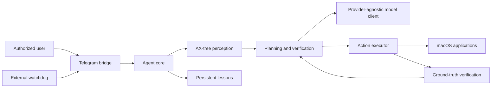

# Architecture

AX Relay is a macOS automation runtime built around one reliability constraint: a model may choose a **numbered interface element**, but it never chooses a screen coordinate.

## Core components

| Component | Responsibility |
|---|---|
| `agents/ax_tree.py` | Enumerates accessible macOS interface elements and assigns stable, task-local IDs. |
| `agents/model_client.py` | Separates model-provider routing from the rest of the agent and supports controlled failover. |
| `agents/orchestrator.py` | Turns a task into sub-goals and asks whether each one is actually achieved. |
| `agents/executor.py` | Resolves an element ID into a system-reported coordinate, performs supported actions, and heuristically gates destructive-looking actions using model text plus selected element metadata. |
| `agents/agent_core.py` | Coordinates the perceive → plan → act → verify loop, locks, watchdogs, and recovery behavior. |
| `agents/telegram_bridge.py` | Provides optional remote control, fails closed until an authorized chat ID is configured, and exposes only `/whoami` during setup. |
| `agents/lessons.py` | Stores concise, persistent corrective lessons between tasks. |

## Design decisions

### 1. Accessibility tree before vision coordinates

A vision model can confuse nearby targets or drift across resolutions. AX Relay reads the macOS Accessibility tree, exposes actionable elements as numbered choices, and resolves the final click using operating-system data. This does not make every interface accessible, but it removes coordinate guessing from the decision boundary.

### 2. Verification is part of execution

A model declaring a task “done” is not treated as proof. The system retains a task-start baseline and evaluates visible state after an action. This is especially important for send/post actions, where text visible in a field is not equivalent to a message actually being sent.

### 3. Providers are an implementation detail

The agent loop does not depend on one model provider. Routing and failure classification live in the model client, so a rate limit or authentication failure can be handled without rewriting perception, execution, or verification logic.

### 4. Safety boundaries are explicit

The project includes an authorized-chat restriction for remote control, a destructive-action gate, local-only configuration, and a public-safety scan. These reduce risk; they do not turn general desktop automation into a security boundary suitable for untrusted users.

## Information boundary

AX Relay is local-first, but it is not “data never leaves the machine.” Task text and Accessibility-tree observations are sent to the model provider selected in local configuration. When screenshot features or remote notifications are enabled, those channels create additional sharing paths. Do not use the project with sensitive applications or data unless you understand and accept the policies of every configured provider and channel.

## Known limitations

- macOS only; it depends on Accessibility APIs and user-granted system permissions.
- Interfaces that do not expose useful Accessibility information remain difficult.
- The remote bridge is a single process; an external watchdog handles process death but cannot guarantee correctness.
- Verification is bounded by the state the system can observe.
